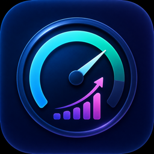

# QuotaX

<p align="center">
  
</p>

<p align="center">
  
  
  
  
  
</p>

A macOS menu bar AI quota monitoring tool. Check your AI service remaining quotas at a glance, just like checking CPU / memory usage.

[中文文档](README_CN.md)

## Features

- **Menu bar resident** — Rotates through remaining percentages of each provider
- **Multi-provider support** — OpenRouter, Codex (ChatGPT), Amp
- **Auto-detect local config** — Codex `auth.json` (official ChatGPT account only), Amp CLI, environment variables
- **System notifications** — Alerts when quota is running low
- **Customizable** — Refresh interval and warning threshold
- **Privacy-first** — API keys are stored locally only, never uploaded

## Supported Providers

| Provider | Data Source | Configuration |
|----------|-------------|---------------|
| OpenRouter | API (`/api/v1/auth/key`) | Manual API Key input or `OPENROUTER_API_KEY` env var |
| Codex | ChatGPT Backend API | Auto-reads `~/.codex/auth.json` (official ChatGPT account only) |
| Amp | `amp usage` command | Auto-detects local CLI |

## Download

| Architecture | DMG | Description |
|-------------|-----|-------------|
| Universal (x86_64 + arm64) | `QuotaX-1.0.dmg` | Works on both Intel and Apple Silicon Macs |
| Apple Silicon | `QuotaX-1.0-arm64.dmg` | arm64 only (smaller size) |
| Intel | `QuotaX-1.0-x86_64.dmg` | x86_64 only (smaller size) |

👉 [Download from Releases](https://github.com/tasselx/QuotaX/releases)

## Requirements

- macOS 14.0+
- Xcode 15+ (for building from source)
- [XcodeGen](https://github.com/yonaskolb/XcodeGen) (for building from source)

## Build

```bash
# Install XcodeGen (if not installed)
brew install xcodegen

# Build Universal binary
make build

# Build and package Universal DMG
make dmg

# Build and package architecture-specific DMG
make dmg-arm64    # Apple Silicon only
make dmg-x86_64   # Intel only

# Build all DMG variants
make dmg-all

# Clean build artifacts
make clean
```

## Project Structure

```
QuotaX/
├── Models/          # Data models (QuotaInfo, AppSettings)
├── Providers/       # Provider adapters (OpenRouter, Codex, Amp)
├── Services/        # Core services (Keychain, Network, Notifications)
├── ViewModels/      # Business logic (QuotaViewModel)
├── Views/           # UI views (Dashboard, Settings)
├── QuotaXApp.swift  # App entry point
└── Info.plist
```

## Security

- Keys stored in `~/Library/Application Support/QuotaX/`, no cloud storage
- No account system, no data upload, no user tracking
- Read-only queries only — never modifies provider data